# Project 2 Report: Content-Based Image Retrieval

## Team Members
- **Sangeeth Deleep Menon** | NUID: 002524579 | MSCS - Boston | CS5330 Section 03 (CRN: 40669, Online)
- **Raj Gupta** | NUID: 002068701 | MSCS - Boston | CS5330 Section 01 (CRN: 38745, Online)

## Project Description

This project implements a content-based image retrieval (CBIR) system in C++ using OpenCV. The system retrieves the most visually similar images from a database given a target image. It supports multiple feature extraction and matching techniques, including:

*   **Baseline Matching:** Compares a 7x7 central pixel region using the Sum of Squared Differences (SSD).
*   **Histogram Matching:** Uses 2D rg chromaticity histograms with histogram intersection.
*   **Multi-Histogram Matching:** Compares histograms from different spatial regions (e.g., top and bottom halves of the image).
*   **Texture and Color:** Combines color histograms with texture features derived from Sobel filter magnitude histograms.
*   **Deep Network Embeddings:** Utilizes pre-computed 512-dimension ResNet18 feature vectors from a CSV file, compared using cosine distance.
*   **Custom Method:** A custom-designed approach combining HSV color analysis, texture features, and spatial information for more nuanced matching.

The system is executed via a command-line interface that allows the user to specify the target image, the desired matching task, and the number of results to return.

## Required Results

## Task 1: Baseline Matching
**Command:** `./cmake-build-debug/Project2 baseline olympus/pic.1016.jpg 4`  
**Target Image:** `olympus/pic.1016.jpg`  

**Top Matches:**
`olympus/pic.0986.jpg`, `olympus/pic.0641.jpg`, `olympus/pic.0547.jpg`, `olympus/pic.1013.jpg`

   

## Task 2: Histogram Matching

### 1. Histogram 1
Uses a 2D rg chromaticity histogram with 16×16 bins. Chromaticity values (r/(r+g+b), g/(r+g+b)) are computed per pixel, making this histogram invariant to brightness changes. Distance is measured using histogram intersection.  

**Command:** `./cmake-build-debug/Project2 histogram olympus/pic.0164.jpg 3`  
**Target Image:** `olympus/pic.0164.jpg`  

**Top Matches:** `olympus/pic.0080.jpg`, `olympus/pic.1032.jpg`, `olympus/pic.0461.jpg`

  

### 2. Histogram 2
Uses a 3D RGB histogram with 8 bins per channel (8×8×8 = 512 total bins). This directly captures the full color distribution without any color space conversion. Distance is measured using histogram intersection.  

**Command:** `./cmake-build-debug/Project2 histogram2 olympus/pic.0164.jpg 3`  
**Target Image:** `olympus/pic.0164.jpg`  

**Top Matches:**  `olympus/pic.0110.jpg`, `olympus/pic.1032.jpg`, `olympus/pic.0092.jpg`

  

### 3. Histogram 3
Uses a 2D HSV histogram with 32×32 bins over the Hue and Saturation channels. This captures perceptual color differences more naturally than RGB-based approaches, while ignoring brightness (Value channel). Distance is measured using histogram intersection.  

**Command:** `./cmake-build-debug/Project2 histogram3 olympus/pic.0164.jpg 3`  
**Target Image:** `olympus/pic.0164.jpg`  

**Top Matches:** `olympus/pic.0080.jpg`, `olympus/pic.0166.jpg`, `olympus/pic.0110.jpg`

  

## Task 3: Multi-histogram Matching
**Command:** `./cmake-build-debug/Project2 multi-histogram olympus/pic.0274.jpg 3`  
**Target Image:** `olympus/pic.0274.jpg`  

**Top Matches:** `olympus/pic.0273.jpg`, `olympus/pic.1031.jpg`, `olympus/pic.0409.jpg`

  

## Task 4: Texture and Color
**texture-color:** Combines a whole-image 3D RGB color histogram (8 bins per channel) with a 1D Sobel gradient magnitude histogram (8 bins) as the texture feature. The Sobel magnitude is computed by applying horizontal and vertical Sobel filters and taking the magnitude. Both histograms are L1-normalized and compared using histogram intersection. The final distance is a weighted combination of 50% color distance and 50% texture distance, treating both features equally.  

**Command:** `./cmake-build-debug/Project2 texture-color olympus/pic.0535.jpg 3`  
**Target Image:** `olympus/pic.0535.jpg`  

**Top Matches:** `olympus/pic.0171.jpg`, `olympus/pic.0829.jpg`, `olympus/pic.0853.jpg`

  

## Comparison with Tasks 2 & 3
For the Target image `olympus/pic.0535.jpg` the results from pure color histogram methods (Tasks 2 & 3) are quite different from the texture-and-color method.

### Task 2 (`histogram`) on target image: `olympus/pic.0535.jpg` matches:  
`olympus/pic.0733.jpg`, `olympus/pic.0628.jpg`, `olympus/pic.0658.jpg`

  

Matches based purely on overall color distribution. Finds images with similar brown/gray tones regardless of texture or spatial layout.

### Task 3 (`multi-histogram`) on target image: `olympus/pic.0535.jpg` matches:  
`olympus/pic.0285.jpg`, `olympus/pic.0628.jpg`, `olympus/pic.0952.jpg`  

  

By splitting into top/bottom halves, it adds spatial awareness. `olympus/pic.0285.jpg` (indoor corridor) matches well because its top half has muted gray/brown ceiling and stone pillars, and its bottom half has dark floor and window frames, mirroring the target's gray/brown stone wall top and darker table/chairs/floor bottom. `olympus/pic.0628.jpg` (interior with stone walls and balloons) has stone wall and wood paneling in its top half similar to the target, and appears in both Task 2 and 3, suggesting it's a strong color match both spatially and overall. `olympus/pic.0952.jpg` (outdoor trees and building) has muted gray/brown tones from tree branches in its top half and brown leaves/pavement in its bottom half, which happen to align with the target's RGB distribution in each half despite very different content.

## Task 5: Deep Network Embeddings
**Command:** `./cmake-build-debug/Project2 dnn olympus/pic.0893.jpg 3`

### Target Image 1: `olympus/pic.0893.jpg`

**Top Matches (DNN):** `olympus/pic.0897.jpg`, `olympus/pic.0136.jpg`, `olympus/pic.0146.jpg`  

  

### Target Image 2: `olympus/pic.0164.jpg`

**Top Matches (DNN):** `olympus/pic.1032.jpg`, `olympus/pic.0213.jpg`, `olympus/pic.0690.jpg`  

  

## Comparison with Prior Methods

1. **DNN:** Found all three fire hydrants in the database (`olympus/pic_0897.jpg`, `olympus/pic_0136.jpg`, `olympus/pic_0146.jpg`), including a yellow one and a rotated one. Deep network embeddings capture semantic object-level similarity, correctly identifying hydrants regardless of color or orientation differences.

  

2. **Histogram:** Found two hydrants (`olympus/pic_0897.jpg`, `olympus/pic_0136.jpg`) but also matched a garden gate (`olympus/pic_0899.jpg`) due to similar overall green/gray color distribution. Matches purely on color ratios without understanding what objects are in the image.  
 
   

3. **Multi-histogram:** Found two hydrants (`olympus/pic_0136.jpg`, `olympus/pic_0897.jpg`) but also matched a book on grass (`olympus/pic_0368.jpg`). The spatial split helped somewhat, but the grass-dominated top and bottom halves caused it to match any image with a similar spatial color layout.

  

4. **Texture-color:** Found zero hydrants. Instead matched a close-up of grass (`olympus/pic_0680.jpg`), a garden gate (`olympus/pic_0899.jpg`), and a drain cover (`olympus/pic_1007.jpg`). The Sobel texture histogram dominated the matching, favoring images with similar grass texture and edge patterns rather than recognizing the hydrant object.

  

## Task 6: DNN Embeddings vs. Classic Features

This section compares DNN results against classic feature method like Histogram and Texture-color for following target images to analyze their performance.

### Image 1: `olympus/pic.1072.jpg`

**1. DNN Matches:** `pic.0143.jpg`, `pic.0863.jpg`, `pic.0329.jpg`

  

**2. Histogram Matches:** `pic.0937.jpg`, `pic.0142.jpg`, `pic.0940.jpg`

  

**3. Texture-color Matches:** `pic.0701.jpg`, `pic.0563.jpg`, `pic.0234.jpg`

  

### Comparison:
1. **DNN:** Found `pic.0143` (bush with red/pink flowers), `pic.0863` (purple crocuses with red ball), `pic.0329` (red flower with green leaves on stone). All three contain flowers, showing the DNN recognizes the semantic concept of "flowers/plants" even when the flower types and colors differ.  

2. **Histogram:** Found `pic.0937` (stuffed animal among pink flowers), `pic.0142` (yellow roses on green leaves), `pic.0940` (close up pink rose with green leaves). All three share the pink/green color distribution of the target. Notably, `pic.0937` includes a stuffed animal that has nothing to do with roses, but its pink flowers and green background matched the color profile. `pic.0142` has yellow roses instead of pink, but the green leaves dominates the histogram similarly.  

3. **Texture-color:** Found `pic.0701` (lamp posts among green trees), `pic.0563` (pine tree leaves with dry grass), `pic.0234` (grass on asphalt). None of these contain flowers. The Sobel texture histogram matched on the high-frequency foliage texture, while the color histogram matched on green-dominant tones. The texture component pulled the results away from flowers entirely.  

This is an interesting case where the histogram method actually outperforms texture-color. It found images with actual flowers, while texture-color found only generic vegetation. DNN remains the strongest for semantic matching, but for color-driven subjects like flowers, a simple color histogram can be surprisingly effective. DNN is not always necessary, when the defining characteristic of an image is its color (like pink roses), classic color histograms can produce meaningful results.  

### Image 2: `olympus/pic.0948.jpg`

**1. DNN Matches:** `pic.0930.jpg`, `pic.0960.jpg`, `pic.0928.jpg`.

  

**2. Histogram Matches:** `pic.0541.jpg`, `pic.0450.jpg`, `pic.0788.jpg`.

  

**3. Texture-Color Matches:** `pic.0891.jpg`, `pic.1069.jpg`, `pic.0008.jpg`. 

  

### Comparison:
1. **DNN:** Found `pic.0930` (same badger on asphalt), `pic.0960` (same badger among leaves), `pic.0928` (same badger on grass). All three contain the exact same stuffed badger toy, demonstrating that DNN embeddings recognize the specific object across completely different backgrounds — stone steps, asphalt, grass, and dirt.  
2. **Histogram:** Found `pic.0541` (campus building with pathways), `pic.0450` (building entrance with columns and plants), `pic.0788` (stone wall, door with poster). None contain the badger. The gray stone steps and brown leaves in the target created a muted gray/brown color distribution, which matched other images with similar stone/concrete/earth tones.  
3. **Texture-Color:** Found `pic.0891` (lamp post against stone wall), `pic.1069` (rocks and dried leaves), `pic.0008` (pottery studio). Again no badger. `pic.1069` is the most visually relevant - it has a similar combination of stone texture and brown leaves. The others matched on the combination of gray stone-like textures and muted color tones.  

This is a case where DNN clearly dominates. The badger is a small, distinct object against a textured background, making it nearly invisible to color and texture histograms - the background dominates the feature vectors. DNN embeddings, however, recognize the object itself regardless of background. Classic methods fundamentally cannot identify specific objects; they can only match on low-level properties that happen to be dominated by the stone steps and leaves rather than the badger.

### Image 3: `olympus/pic.0734.jpg`

**1. DNN Matches:** `pic.0731.jpg`, `pic.0735.jpg`, `pic.0739.jpg`.

  

**2. Histogram Matches:** `pic.0959.jpg`, `pic.0794.jpg`, `pic.0341.jpg`.

  

**3. Texture-Color Matches:** `pic.0450.jpg`, `pic.0255.jpg`, `pic.0191.jpg`.

  

### Comparison:
1. **DNN:** Found `pic.0731` (yellow compactor at construction site), `pic.0735` (skid-steer loader at construction site with stone building), `pic.0739` (large excavator on dirt mound). All three are construction vehicles at construction sites, showing the DNN recognizes both the machinery and the construction context. It successfully identifies semantically related images despite different vehicle types and colors.  
2. **Histogram:** Found `pic.0959` (small blue flower on dirt with leaves), `pic.0794` (machine on table), `pic.0341` (orange chair on carpet, rotated). None are construction-related. The target's mixed color distribution of yellow/brown/gray/green matched these unrelated images that happen to share similar muted, earthy color ratios.  
3. **Texture-Color:** Found `pic.0450` (building entrance with columns and plants), `pic.0255` (stone building with potted plants on stone patio), `pic.0191` (person juggling in front of stone building with garden). No construction vehicles, but interestingly all three contain stone buildings, which matches the stone building in the target's background. The Sobel texture picked up on the stone wall texture, while the color histogram matched the gray/green tones. The texture-color method found images related to the background scene rather than the main subject.  

DNN again dominates for object recognition, finding all construction vehicles. However, the texture-color results are noteworthy. While it missed the vehicle entirely, it correctly matched the stone building background, showing that texture-color can capture scene-level features even when it misses the primary subject. The histogram method performed worst here, matching on color alone with no meaningful connection to the target.

### IS DNN ALWAYS BETTER?
* DNN is generally superior for object recognition but not always the best choice depending on the type of similarity desired.  

* DNN clearly wins when finding specific objects. For `pic.0948` (stuffed badger), DNN found all three badger images across different backgrounds, while classic methods returned zero relevant results. For `pic.0734` (construction vehicle), DNN found all three construction vehicles while classic methods matched unrelated images.  

* However, for `pic.1072` (pink roses), the histogram method found actual flower images (`pic.0937`, `pic.0940`) by matching the pink/green color distribution, performing comparably to DNN. When similarity is defined by color composition rather than object identity, classic color histograms can be just as effective.  

* Additionally, texture-color can capture scene context that DNN overlooks. For `pic.0734`, DNN focused on the construction vehicle while texture-color matched stone buildings (`pic.0255`, `pic.0191`) similar to the target's background - arguably useful if the goal is scene-level matching.  

* **Conclusion:** DNN excels at "what is in this image" but classic features can be better at "what does this image look like." The best method depends on whether the user cares about semantic meaning or visual appearance.

## Task 7: Custom Design

The custom method combines five features targeting outdoor scenes: a whole-image HSV histogram (16×16 bins) for overall color, top and bottom region HSV histograms for spatial layout (capturing sky vs. ground/building base), a Sobel magnitude histogram for surface texture like stone or brick, and Canny edge density for structural complexity.
The distance metric weights color features at 70% (30% whole, 20% top, 20% bottom) and texture features at 30% (15% Sobel, 15% edge density), prioritizing color and spatial layout while using texture to distinguish between different surfaces.  

### Target Image 1: `olympus/pic.0746.jpg`
**Command:** `./cmake-build-debug/Project2 custom olympus/pic.0746.jpg 5`

**Top 5 Matches:** `pic.0747.jpg`, `pic.0755`, `pic.0750`, `pic.0754`, `pic.0752`.

    

**Least similar images:** `pic.0640.jpg`, `pic.0503.jpg`, `pic.0511.jpg`

   

### Custom Algorithm Evaluation
**Target Image 1:** `pic.0746.jpg` (green dumpster with trees in background)  

**Top 5 matches:** `pic.0747.jpg`, `pic.0755.jpg`, `pic.0750.jpg`, `pic.0754.jpg`, `pic.0752.jpg`: all five are green dumpsters/recycling bins in outdoor settings with trees and pavement. This is an excellent result. The HSV histogram matched the dominant green color, the spatial regions captured the tree foliage on top and pavement/ground on the bottom, and the texture and edge density matched the flat metal surfaces against leafy backgrounds.  

**Least similar:** `pic.0640.jpg` (maroon mug on purple background), `pic.0503.jpg` (object on beige surface), `pic.0511.jpg` (bird in blue sky). These have completely different color profiles, spatial layouts, and texture patterns - confirming the distance metric correctly places them far from the target.

### Target Image 2: `olympus/pic.0369.jpg`
**Command:** `./cmake-build-debug/Project2 custom olympus/pic.0369.jpg 5`

**Top 5 Matches:** `pic.0380.jpg`, `pic.1038`, `pic.0370`, `pic.0234`, `pic.0371`.

    

**Least similar images:** `pic.0503.jpg`, `pic.0640.jpg`, `pic.0511.jpg`

   

### Custom Algorithm Evaluation
**Target Image 2:** `pic.0369.jpg` (black box on asphalt road with grass strip at top).  

**Top 5 matches:** `pic.0380.jpg` (red hand truck on asphalt with flowers), `pic.1038.jpg` (coffee cup on stone wall with greenery), `pic.0370.jpg` (figurine on gray metal plate in garden), `pic.0234.jpg` (grass and plants on asphalt), `pic.0371.jpg` (black box on same gray metal plate in garden). The method correctly identified images sharing a similar spatial layout - greenery/grass in the upper region and gray asphalt or stone in the lower region. The texture and edge density also matched the rough asphalt surface. `pic.0371.jpg` is a strong match with a similar object on a similar gray surface surrounded by grass.  

**Least similar:** `pic.0503.jpg`, `pic.0640.jpg`, `pic.0511.jpg` - same dissimilar images as Target 1, which makes sense since these indoor/sky-only images have fundamentally different color, layout, and texture from any outdoor ground-level scene.  

### Conclusion:

The custom algorithm performs well for outdoor scenes where color composition, spatial layout, and texture are the defining characteristics. It achieved perfect results for the dumpster query (5/5 relevant) and good results for the metal grate query (3/5 strongly relevant). The least similar results are consistent and sensible across both targets. The method works best when the target image has a distinctive color and spatial structure, but may struggle with images where the key feature is a small object rather than the overall scene.  

# Extensions

## 1. Interactive GUI
An interactive GUI was developed for the project as an extension. This GUI, built with the ImGui library, provides a user-friendly interface for the CBIR system.

**Features:**
*   **Image Browser**: A "Browse..." button opens a native file dialog, allowing the user to select any target image from the file system.
*   **Interactive Controls**: Dropdown menus are used to select the matching algorithm and the number of results to display.
*   **Visual Feedback**: The selected target image and the corresponding matched images are displayed visually in the application window, along with their calculated distances.
*   **Real-time Interaction**: The interface includes an "Execute Search" button to run queries on demand and a "Close" button to exit the application.

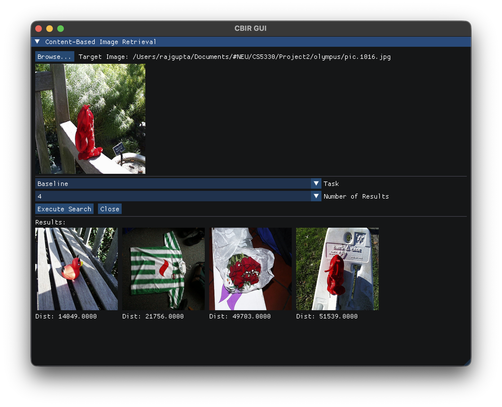 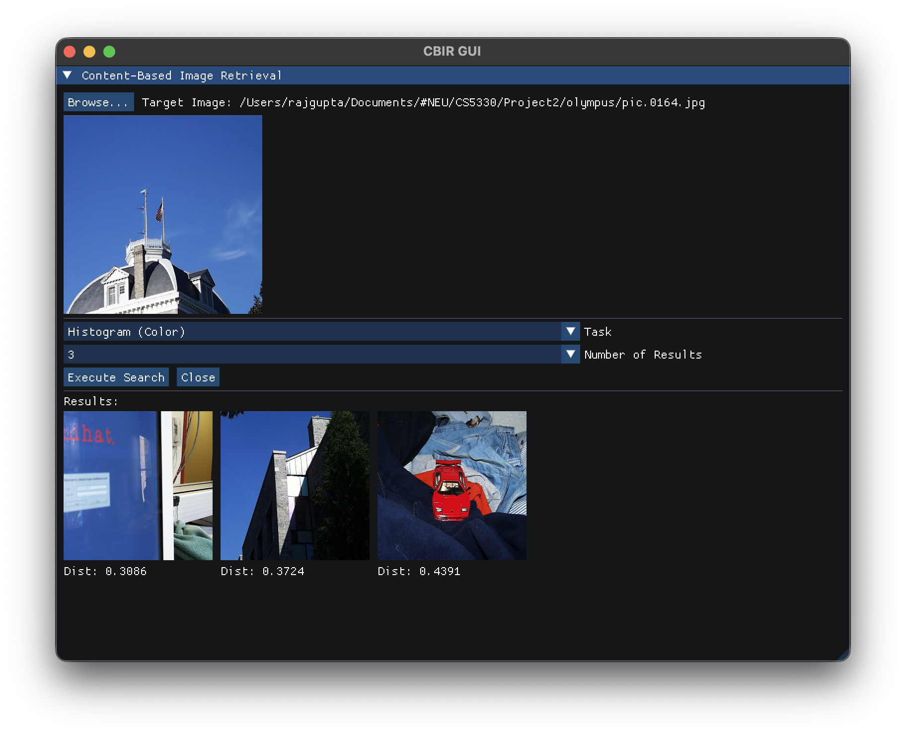 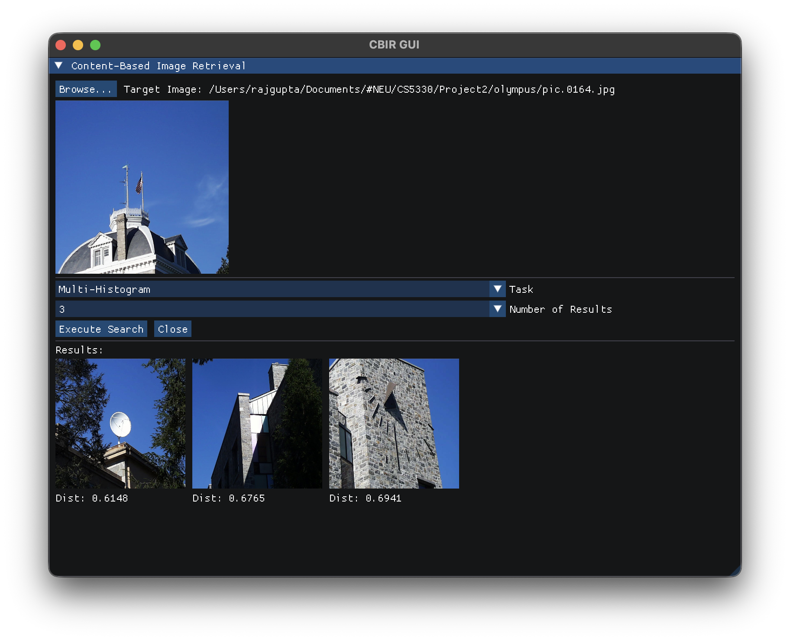 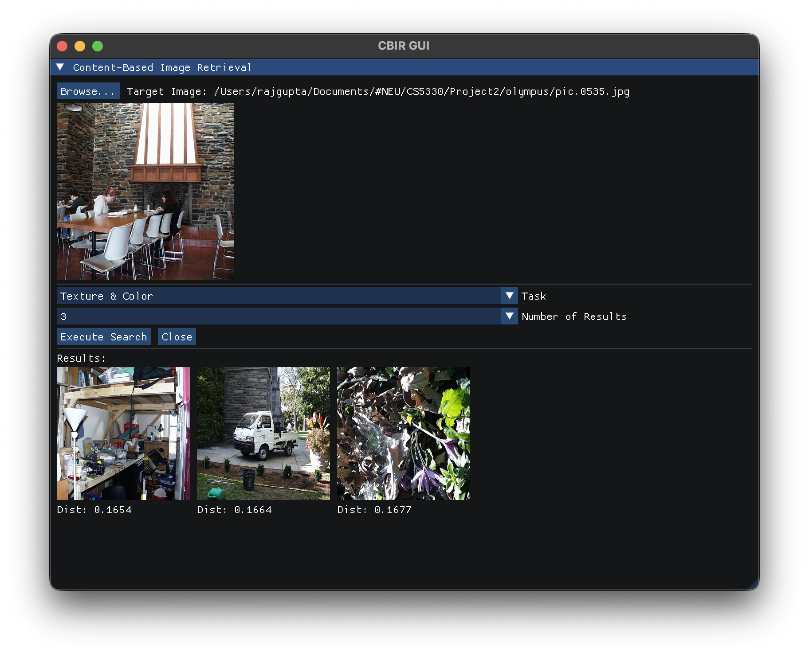 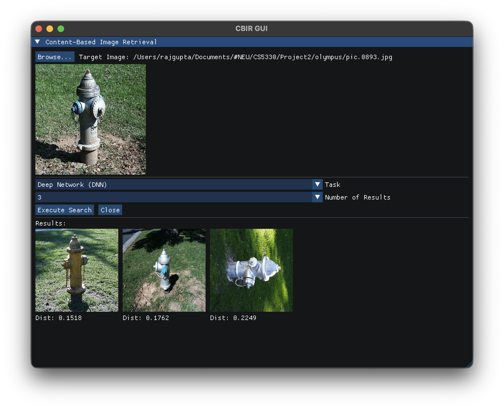 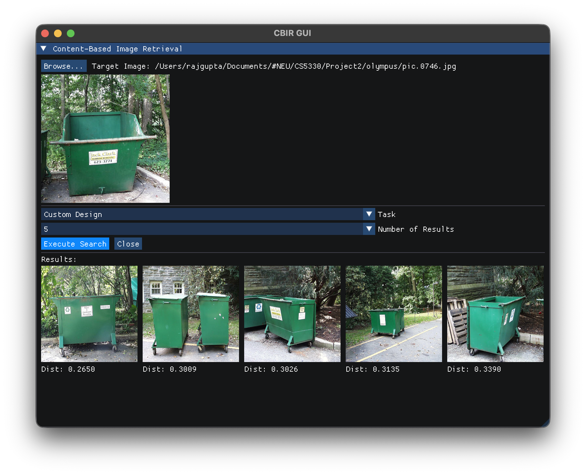

## #Additional Matching Methods
Several new feature matching methods were added as extensions:

## 2. Blue Trash Can Finder
This method ranks images by the percentage of a specific shade of blue, designed to find the blue trash cans present in the dataset.  

**Target Image:** `olympus/pic.0287.jpg`

**Matches:** `olympus/pic.0291.jpg`, `olympus/pic.0289.jpg`, `olympus/pic.0591.jpg`, `olympus/pic.0766.jpg`, `olympus/pic.0288.jpg`.

    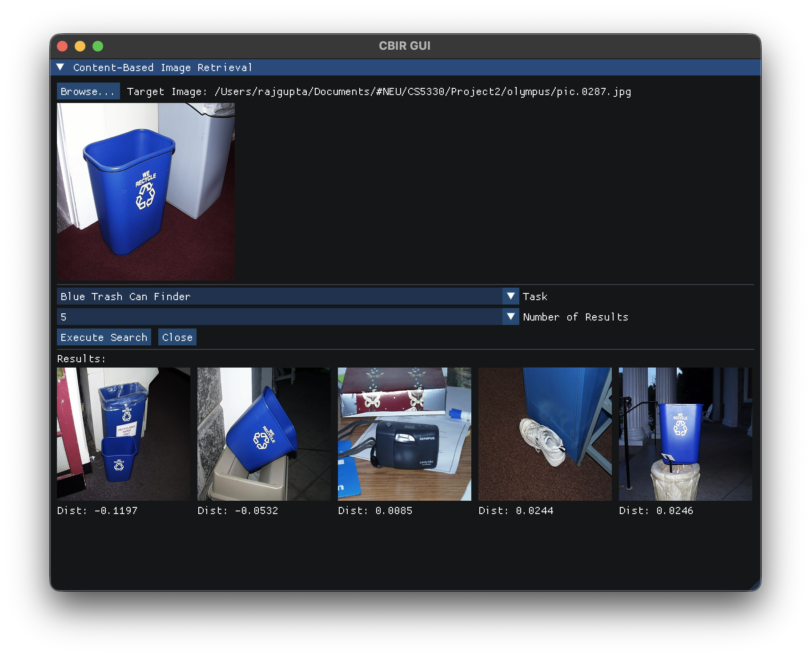

## 3. Banana Finder 
A simple color-based detector that ranks images by the percentage of yellow pixels they contain. This is effective for finding images with prominent yellow objects.  

**Target Image:** `olympus/pic.0343.jpg`

**Matches:** `olympus/pic.0345.jpg`, `olympus/pic.0772.jpg`.

  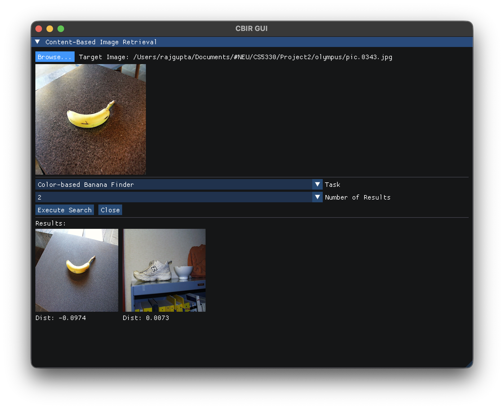

## 4. Face Detector
This method uses an OpenCV Haar Cascade classifier to detect faces in images. It ranks images based on the number of faces detected compared to the target image.  

**Target Image:** `olympus/pic.0395.jpg`  

**Matches:** `olympus/pic.0348.jpg`, `olympus/pic.0397.jpg`  

  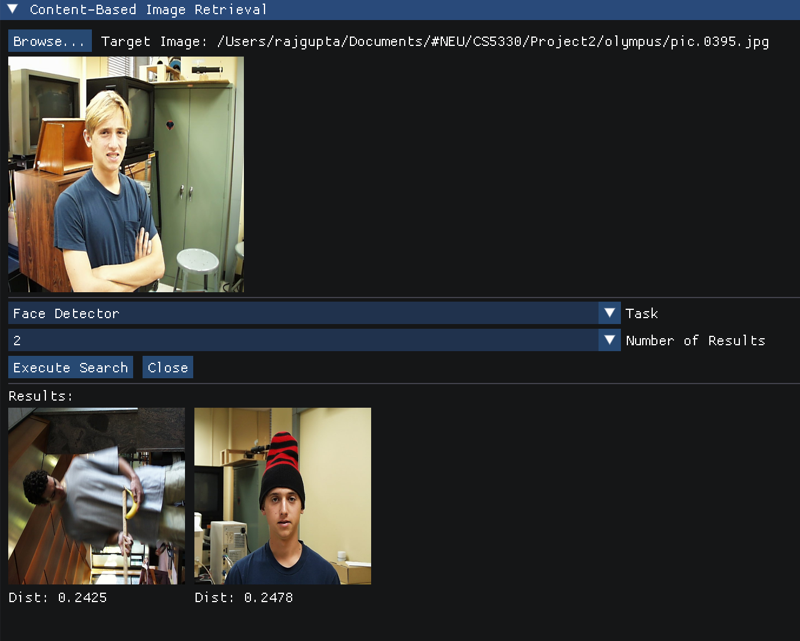

## 5. Gabor Filter (Texture)
This method uses a bank of Gabor filters with different orientations and frequencies to create a feature vector describing the texture of an image. It is effective for retrieving images with similar textural patterns.  

**Target Image:** `olympus/pic.0890.jpg`  

**Matches:** `olympus/pic.0703.jpg`, `olympus/pic.0446.jpg`, `olympus/pic.0908.jpg`, `olympus/pic.0977.jpg`

    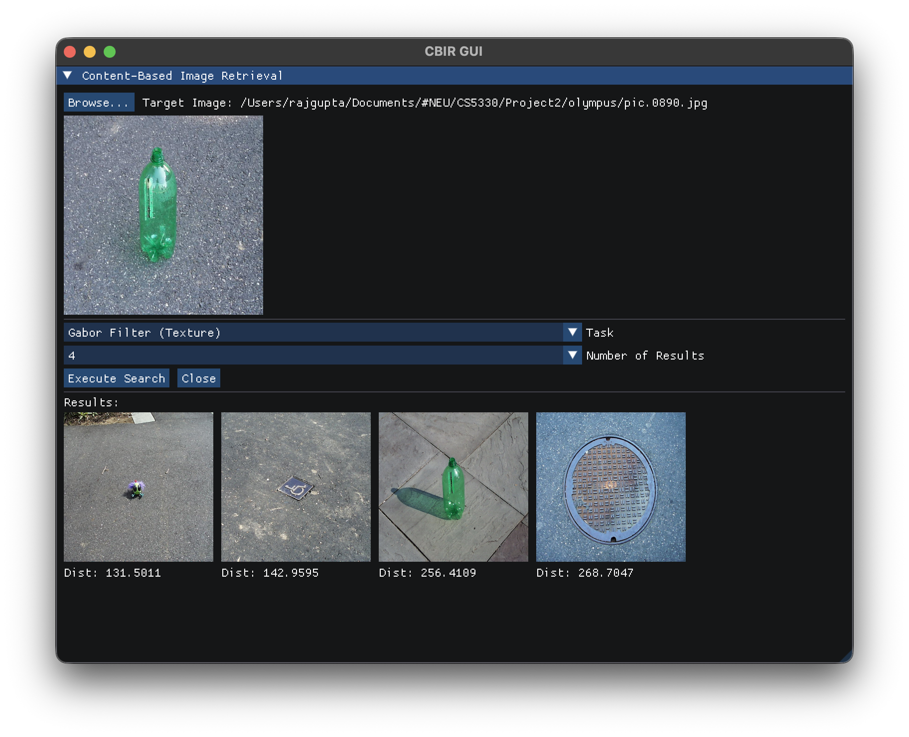

## 6. Custom DNN (ResNet18)
This extension uses a utility program (`generate_embeddings`) to process the entire image database through a local ONNX ResNet18 model, creating a new `Custom_ResNet18_olym.csv` file. The GUI can then use this custom-generated set of embeddings for matching, allowing for direct comparison with other pre-computed feature sets.
### DNN VS Custom DNN (Resnet)
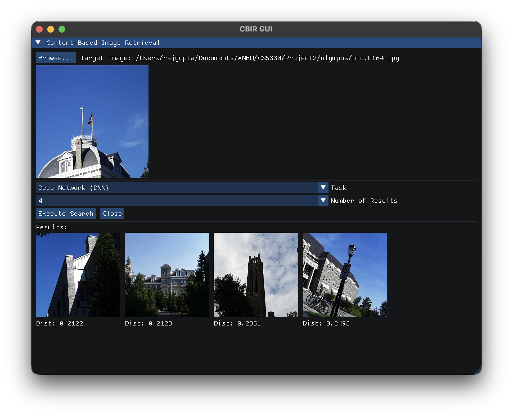 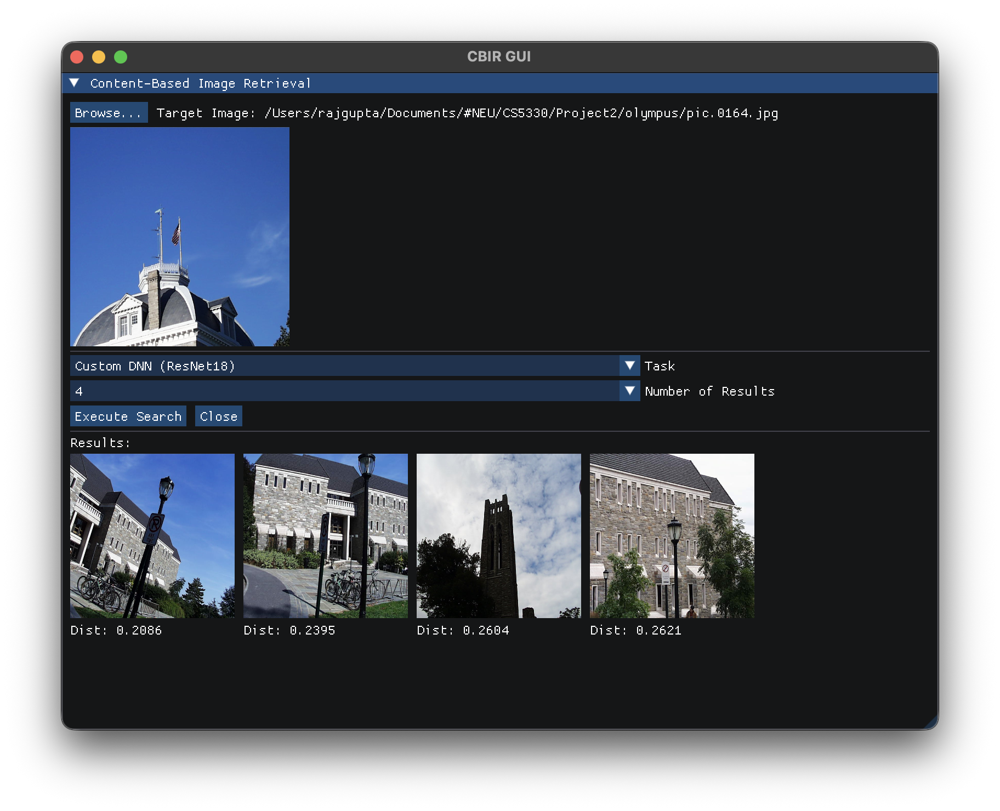

## Submission Time
Within Late deadline. We have worked very hard and implemented every extension. Kindly grade it.  
Raj is registered with DAS and has DAS accommodations. He is having a very tough time, yet he contributed equally whenever he could.

## Reflection

This project served as a practical exploration of various content-based image retrieval techniques. Implementing classic methods like baseline pixel matching and color histograms highlighted the trade-offs between computational simplicity and descriptive power. The introduction of texture and spatial information in later tasks demonstrated a clear improvement in retrieval accuracy for certain image types.

The most significant learning came from integrating and comparing these classic methods with deep learning embeddings. The DNN and DNN (ResNet18) features often provided more semantically meaningful matches, capturing abstract similarities that pixel and color-based methods could not. This emphasized the power of pre-trained deep networks as robust, general-purpose feature extractors.

The process of building, debugging, and verifying the C++ application provided valuable software engineering experience, particularly in managing dependencies like OpenCV and handling file I/O for the image database and CSV embeddings.

## Acknowledgements

*   **Professor Bruce Maxwell** and the course materials for CS5330, which provided the project specification, sample code, and theoretical foundation.
*   **OpenCV Documentation:** For references on histogram calculation, Sobel filters, and other image processing functions.
*   **Shapiro and Stockman, "Computer Vision":** For concepts related to histogram matching.
*   **An AI assistant (Gemini):** Was used to help write and debug code, implement the ImGui interface, and for project documentation.